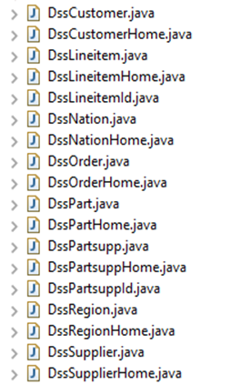

# SQL to NoSQL migration
> Transfer your data from SQL to MongoDB.


## Objective
This project aims at helping research in the automation of the migration of a relational database to NoSQL. The importation of the initial schema to [**Modelio**](https://www.modelio.org/) will allow for modifications at will. The schema is then exported into an XMI that will be read and used to supervise the exportation of the data to JSON files which will be imported to [**MongoDB**](https://www.mongodb.com/).


## Progress
Done :
- Extraction into Java clases
- Modelio import
- XMI reading
- JSON creation and import

To Do :
- Extract the metadata
- Improve JSON creation (storing rows into a single JSONArray is not a good solution)
- Fetch foreign keys

## Example
> Using the [**TPC-D**](https://relational.fit.cvut.cz/dataset/TPCD) Benchmark.

- Mapping of the classes using [__Hibernate__](http://hibernate.org/).

<p align="center">
  
</p>

- Export in [**Modelio**](https://www.modelio.org/)

<p align="center">
  
</p>

- JSON creation using the [**XMI**](https://github.com/IlyessAgg/PII/blob/master/source/file.xmi) file.

<p align="center">
  
</p>

- [**MongoDB**](https://www.mongodb.com/) import.

```cmd
> mongoimport --db Cities --colection customer --file dss_customer.json --jsonArray
connected to: localhost
[############............] Cities.customer       24.3MB/45.8MB (53.1%)
[########################] Cities.customer       45.8MB/45.8MB (100.0%)
imported 150000 documents
```

```cmd
> show collections;
customer
nation
part
partsupp
supplier
```

## Issues
