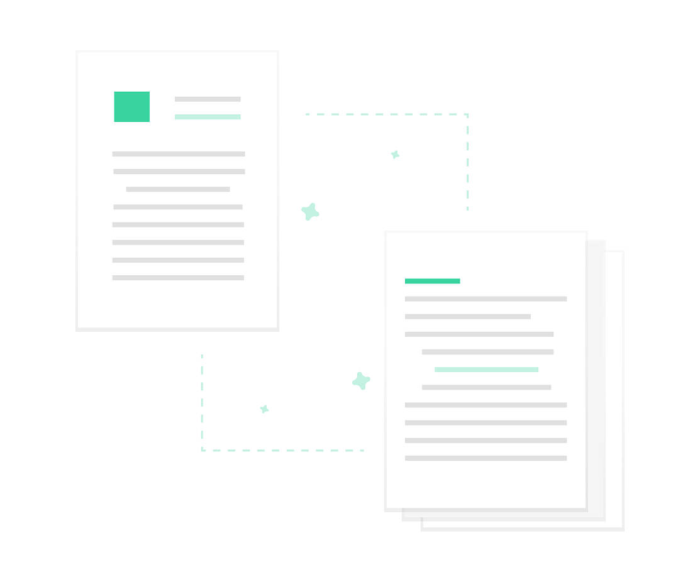

# Data migration
> XMI Parsing and JSON creation.

<p align="center">
  
</p>

## How it works
- We use a document builder to parse the XMI.
```java
DocumentBuilderFactory docBuilderFactory = DocumentBuilderFactory.newInstance();
DocumentBuilder docBuilder = docBuilderFactory.newDocumentBuilder();
Document doc = docBuilder.parse(new File(FILE_ADDRESS));
doc.getDocumentElement().normalize();
```

- We loop through every class element and get the attributes.
> For each class we get the **name, the attributes and the table** it originated from.\
> For each attribute we get the **name, type and the column** it originated from.

Here's what we fetch to get the **column name.**
```xml
<ownedOperation xmi:id="_tRcNUzaeEem6OuT1CeD2qw" name="getNNationkey" visibility="public">
  <ownedComment xmi:id="_tRcNVDaeEem6OuT1CeD2qw">
          <body>@Id
@Column(name = &quot;n_nationkey&quot;, unique = true, nullable = false)</body>
  </ownedComment>
```
What still needs to be done is to fetch data from attributes like these:
```xml
<ownedOperation xmi:id="_tRcNhzaeEem6OuT1CeD2qw" name="getDssCustomers" visibility="public">
  <ownedComment xmi:id="_tRcNiDaeEem6OuT1CeD2qw">
          <body>@OneToMany(fetch = FetchType.LAZY, mappedBy = &quot;dssNation&quot;)</body>
  </ownedComment>
```
